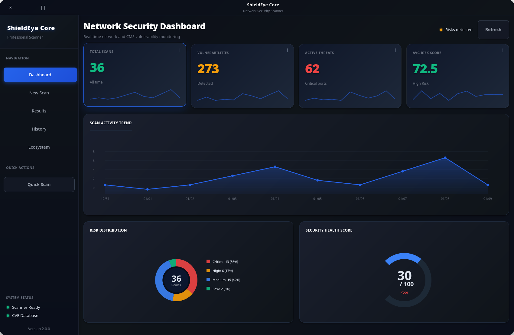
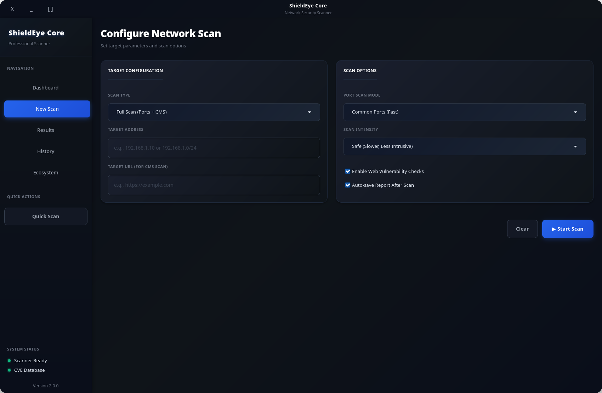
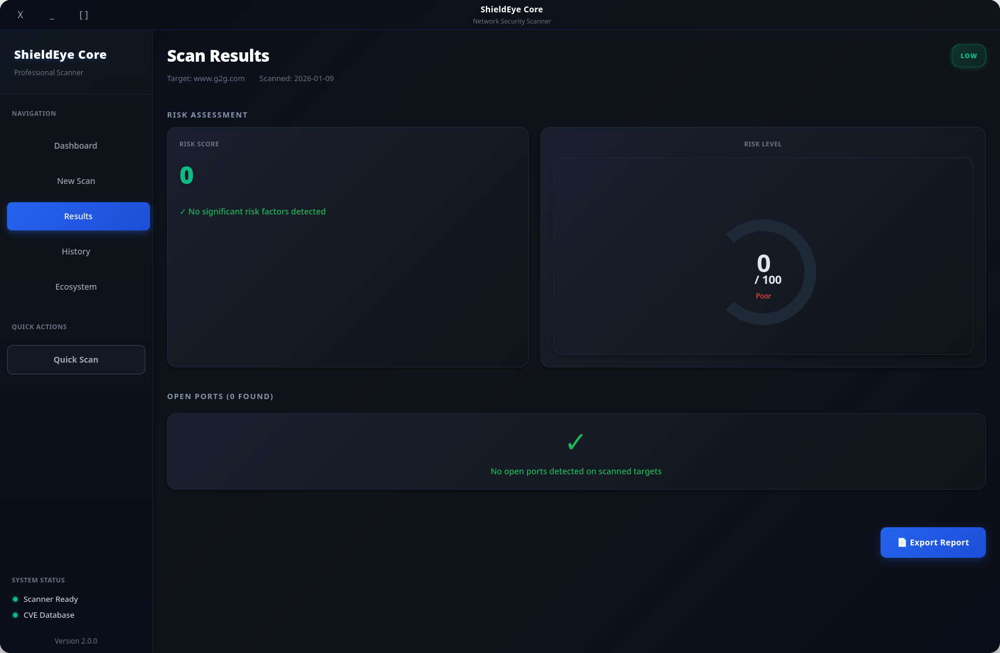
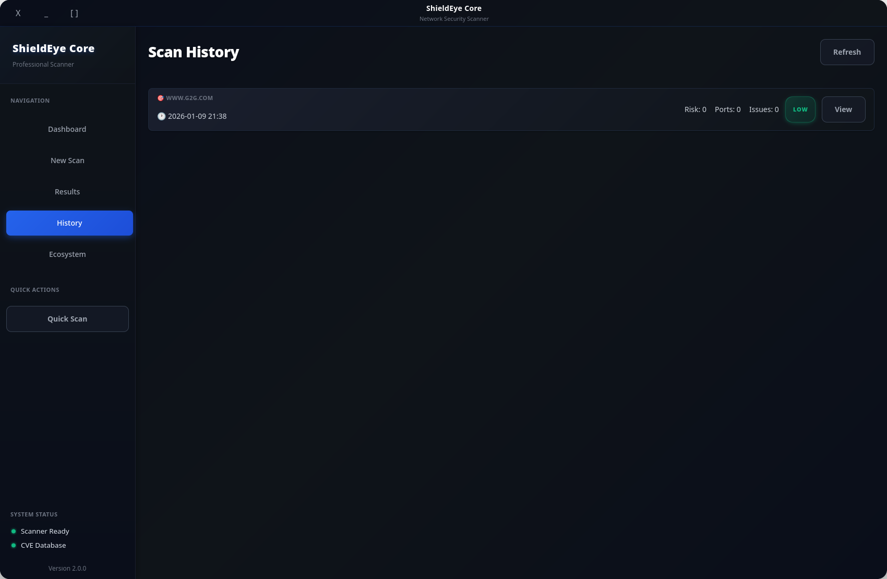

<div align="center">

# 🛡️ ShieldEye Core

**Network Security Scanner for Linux**

*Port scanning • CMS vulnerability detection • Security headers analysis*

[](https://opensource.org/licenses/MIT)
[](https://www.python.org/)
[](https://www.gtk.org/)
[](https://nmap.org/)

[Features](#features) • [Quick Start](#quick-start) • [Screenshots](#screenshots) • [Documentation](#documentation) • [Architecture](#architecture)

---




</div>

---

## What is ShieldEye Core?

ShieldEye Core is a desktop network security scanner. It wraps Nmap for port and
service discovery, fingerprints common CMS platforms and cross-references their
versions against the CIRCL CVE database, and grades a site's HTTP security
headers. Results are shown in a native GTK 4 GUI (there is also a CLI).

It's aimed at security researchers, pentesters, and sysadmins who want a quick,
local read on a host or a small network, not a replacement for a full
vulnerability-management suite.

> ⚠️ **Authorized use only.** Only scan systems you own or have explicit written
> permission to test. Port scanning and vulnerability probing can be disruptive
> and, in many jurisdictions, illegal without consent.

---

## Features

<table>
<tr>
<td width="50%">

### Scanning
- **Port ranges**: common, critical, full 1-65535, or custom
- **Service detection**: version fingerprinting via Nmap
- **OS fingerprinting**: best-effort, when Nmap has enough signal
- **Network scans**: CIDR notation (e.g. `192.168.1.0/24`, up to /16)
- **Safe / aggressive** profiles with optional rate-limited "stealth" timing

</td>
<td width="50%">

### Web Analysis
- **CMS detection**: WordPress, Joomla, Drupal, Magento, and more
- **CVE lookup**: live data from the CIRCL CVE Search API
- **Security headers**: 10 headers scored 0-100 with a letter grade
- **Heuristic web checks**: reflected XSS, SQLi, and path-traversal signals

</td>
</tr>
<tr>
<td width="50%">

### Interface
- **GTK 4 desktop app** with a dark theme
- **Charts**: area, donut, and radial gauges for the dashboard
- **Scan history**: stored in a local SQLite database
- **Reports**: JSON export and PDF (ReportLab)

</td>
<td width="50%">

### Safety & robustness
- **SSRF-aware validation**: targets resolving to loopback, link-local, or
  cloud-metadata addresses are rejected, and HTTP redirects are re-checked
- **Argument-injection guard** on scan targets before they reach Nmap
- **Rate limiting**: per-target and global request throttling
- **Typed exception hierarchy** and structured logging
- **149 tests** (`pytest`)

</td>
</tr>
</table>

---

## Screenshots

<div align="center">

| Dashboard | Scan Configuration |
|:---------:|:------------------:|
|  |  |
| *Security posture and recent activity* | *Scan setup with single / network / full modes* |

| Results | History |
|:-------:|:-------:|
|  |  |
| *Findings with severity levels* | *Scan timeline and trends* |

</div>

---

## Architecture

A modular Python backend behind a native GTK frontend:

```
┌──────────────────────────────────────────────────────────────┐
│                    GTK 4.0 Desktop GUI                        │
│                  (Python 3.10+ + PyGObject)                   │
└─────────────────────────────┬────────────────────────────────┘
                              │ Direct calls
                              ▼
┌──────────────────────────────────────────────────────────────┐
│                   ShieldEye Core Backend                      │
│              Orchestration • Validation • History             │
└───────┬─────────────────────┬─────────────────────┬──────────┘
        │                     │                     │
        ▼                     ▼                     ▼
┌───────────────┐    ┌───────────────┐    ┌───────────────┐
│ Port Scanner  │    │  CMS Scanner  │    │ SSL/DNS Scan  │
│    (Nmap)     │    │  (CVE Check)  │    │ (Certificate) │
└───────────────┘    └───────────────┘    └───────────────┘
        │                     │                     │
        └──────────┬──────────┴─────────────────────┘
                   ▼
    ┌─────────────────────────────────┐
    │   CIRCL CVE API  •  Nmap Engine │
    │   (External)       (System)     │
    └─────────────────────────────────┘
```

### Tech Stack

| Layer | Technology |
|-------|------------|
| **Frontend** | GTK 4.0, Python 3.10+, PyGObject |
| **Backend** | Python 3.10+, Nmap, Requests |
| **Scanning** | python-nmap, BeautifulSoup4 |
| **Security** | OpenSSL, cryptography, dnspython |
| **Reports** | ReportLab (PDF generation) |
| **CVE Data** | CIRCL CVE Search API |

---

## Quick Start

### Prerequisites

| Requirement | Version | Notes |
|-------------|---------|-------|
| Python | 3.10+ | |
| GTK | 4.0+ | system package (not pip) |
| PyGObject | - | system package, see below |
| Nmap | recent | system installation |
| Linux | - | tested on Arch, Ubuntu/Debian, Fedora |

### 1. Install system dependencies

GTK and PyGObject (`gi`) are provided by your distro, **not** by pip:

```bash
# Arch
sudo pacman -S gtk4 python-gobject nmap

# Ubuntu / Debian
sudo apt install libgtk-4-1 python3-gi python3-gi-cairo gir1.2-gtk-4.0 nmap

# Fedora
sudo dnf install gtk4 python3-gobject nmap
```

### 2. Get the code and install Python deps

The easiest path is the launcher, which creates the virtualenv **with access to
the system GTK bindings** and installs everything:

```bash
git clone https://github.com/exiv703/ShieldEye-Core.git
cd ShieldEye-Core
./run.sh            # interactive menu (run / reset data / install deps)
```

Prefer to do it by hand? The `--system-site-packages` flag is required so the
venv can see the system `gi`/GTK modules:

```bash
python3 -m venv --system-site-packages venv
source venv/bin/activate
pip install -r requirements.txt
```

### 3. Grant Nmap capabilities (optional but recommended)

Some Nmap features (SYN scan, OS detection) need raw-socket privileges. Granting
capabilities once avoids running the whole app as root:

```bash
sudo setcap cap_net_raw,cap_net_admin,cap_net_bind_service+eip "$(command -v nmap)"
```

### 4. Launch

```bash
./run.sh                    # recommended
# or, with the venv activated:
python -m gtk_gui_pro.app
```

### 5. CLI mode

```bash
python cli.py scan-ports --target 192.168.1.10 --port-mode common
python cli.py scan-cms   --url https://example.com --web-vulns
python cli.py full-scan  --target 192.168.1.0/24  --url https://example.com
```

---

## Using `run.sh`

`run.sh` is an interactive launcher (no subcommands) with four options:

```text
1) Run ShieldEye Security Scanner   # launch the GTK GUI
2) Reset history & local data       # clear the local SQLite DB
3) Install dependencies             # Python + system deps
4) Exit
```

Tests are run directly with `pytest` (see [Development](#development)).

---

## Configuration

Scan parameters, rate limits, timeouts, and alert thresholds live in
`backend/config.py`. See [STRUCTURE.md](docs/STRUCTURE.md) for the layout.

Core dependencies: `python-nmap`, `requests`, `beautifulsoup4`, `cryptography`,
`reportlab`, plus system `PyGObject`/GTK. Full list in `requirements.txt`.

---

## Documentation

- **[STRUCTURE.md](docs/STRUCTURE.md)** - project layout and modules
- **[INTEGRATION_GUIDE.md](docs/INTEGRATION_GUIDE.md)** - using the backend from your own code
- **[TROUBLESHOOTING.md](docs/TROUBLESHOOTING.md)** - common setup and runtime issues

---

## API Usage

```python
from backend import ShieldEyeBackend

backend = ShieldEyeBackend()

# Port scan
results = backend.scan_ports(target="192.168.1.10", port_mode="common", scan_mode="safe")

# CMS scan with CVE lookup
cms_result = backend.scan_cms(url="https://example.com", web_vulns=True)

# Combined port + CMS scan
full_result = backend.full_scan(target="192.168.1.10", url="https://example.com")
```

---

## Development

```bash
git clone https://github.com/exiv703/ShieldEye-Core.git
cd ShieldEye-Core
python3 -m venv --system-site-packages venv
source venv/bin/activate
pip install -r requirements.txt
pip install -r requirements-dev.txt

pytest
pytest --cov=backend --cov-report=html
```

---

## Contributing

Contributions are welcome.

1. Fork the repository
2. Create a branch (`git checkout -b my-change`)
3. Commit your changes
4. Push and open a Pull Request

Please keep to PEP 8, add type hints where they help, and cover new behavior
with tests.

---

## License

MIT - see [LICENSE](LICENSE).

**For educational and authorized security testing only.**

---

## Acknowledgments

- **Nmap** - network scanning engine
- **CIRCL** - CVE database API
- **GTK Project** - GUI toolkit
- The Python ecosystem this is built on

---

## Related Projects

Part of the **ShieldEye** set of tools:

- **[ShieldEye SurfaceScan](https://github.com/exiv703/ShieldEye-SurfaceScan)** - web attack-surface mapper
- **[ShieldEye NeuralScan](https://github.com/exiv703/ShieldEye-NeuralScan)** - local source-code security scanner
- **[ShieldEye ComplianceScan](https://github.com/exiv703/ShieldEye_ComplianceScan)** - GDPR / PCI-DSS / ISO 27001 compliance scanner

---

<div align="center">

[Report a Bug](https://github.com/exiv703/ShieldEye-Core/issues) • [Request a Feature](https://github.com/exiv703/ShieldEye-Core/issues)

</div>
